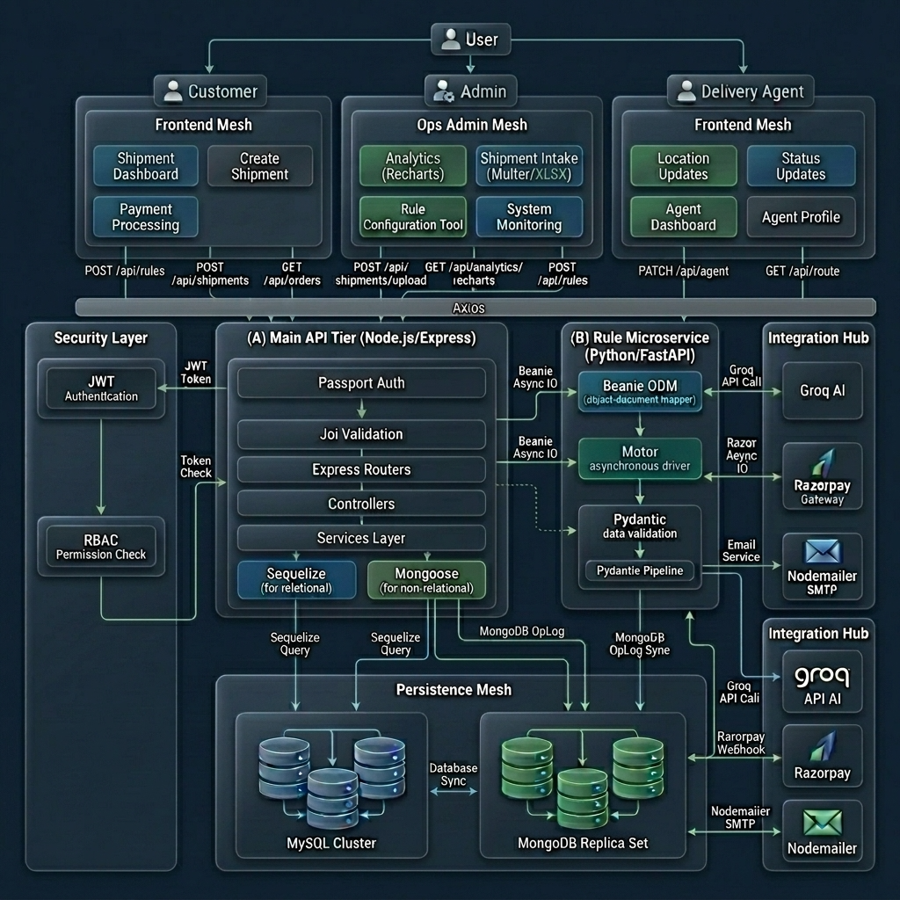
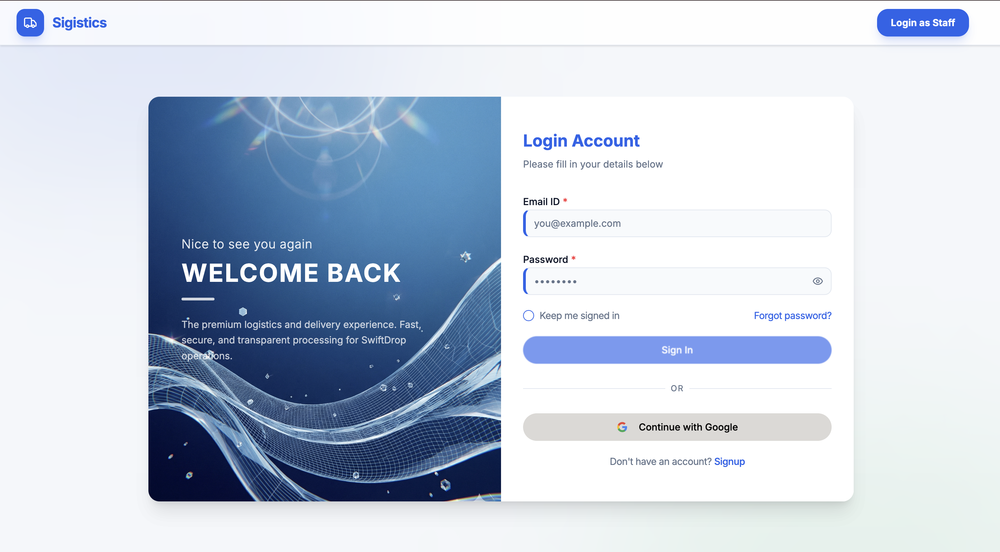
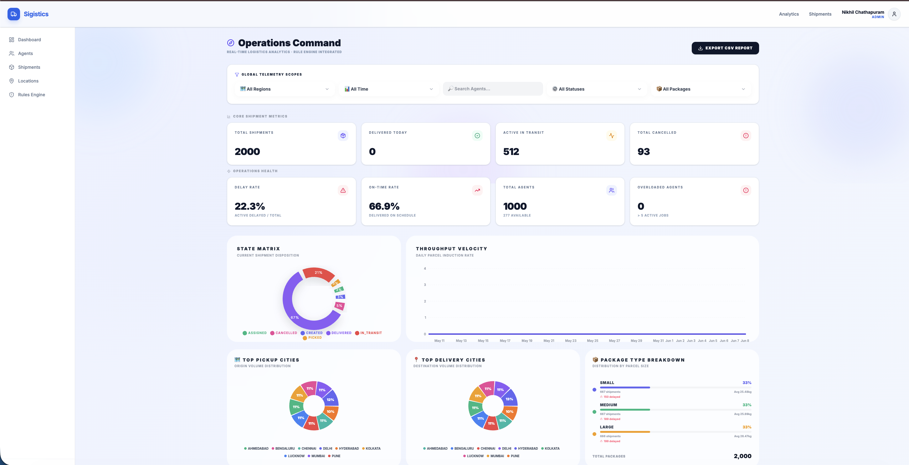
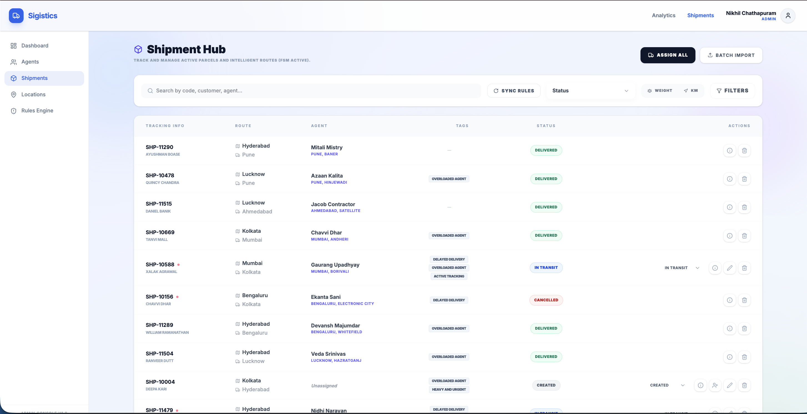
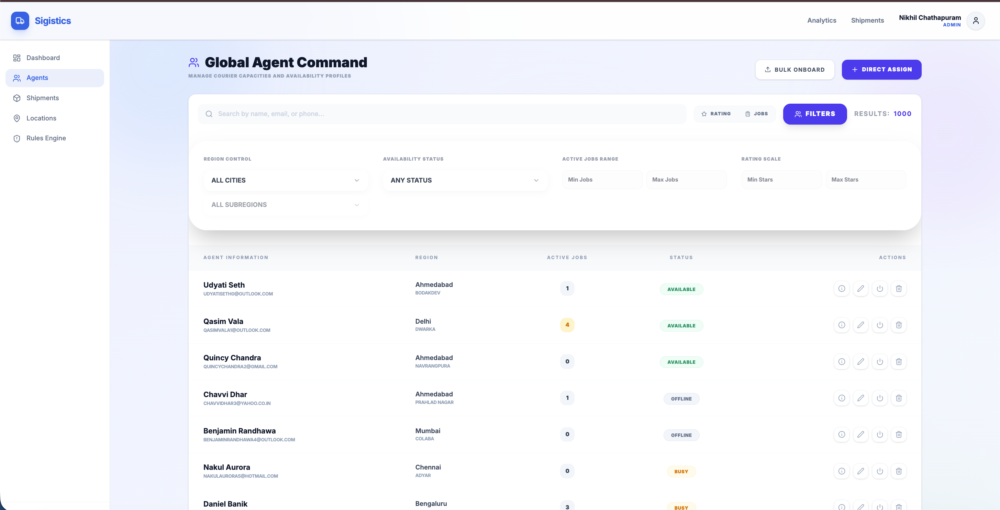
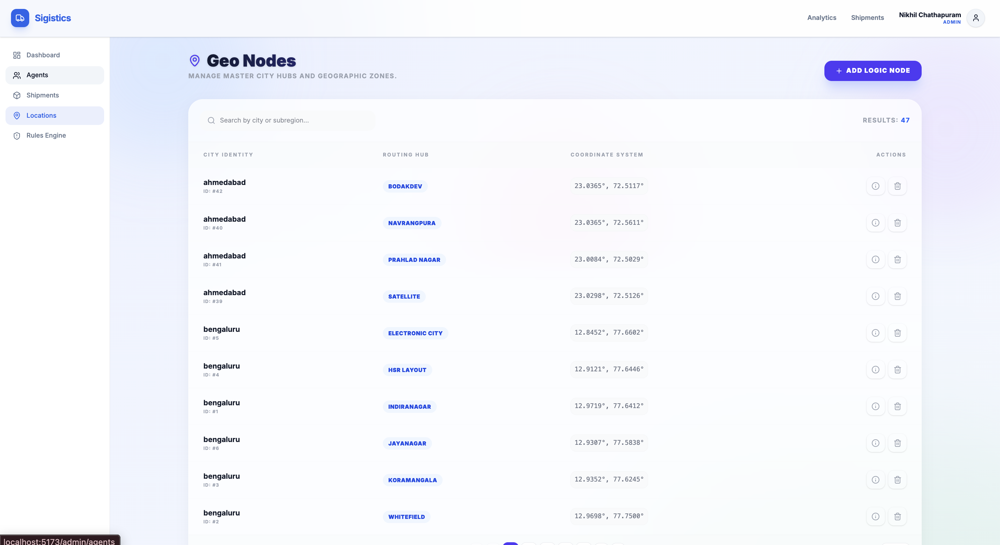
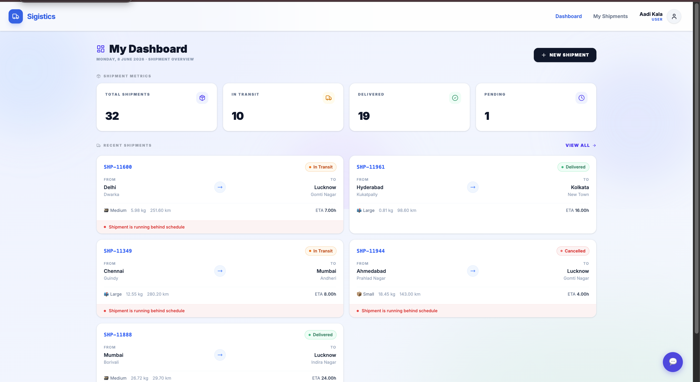
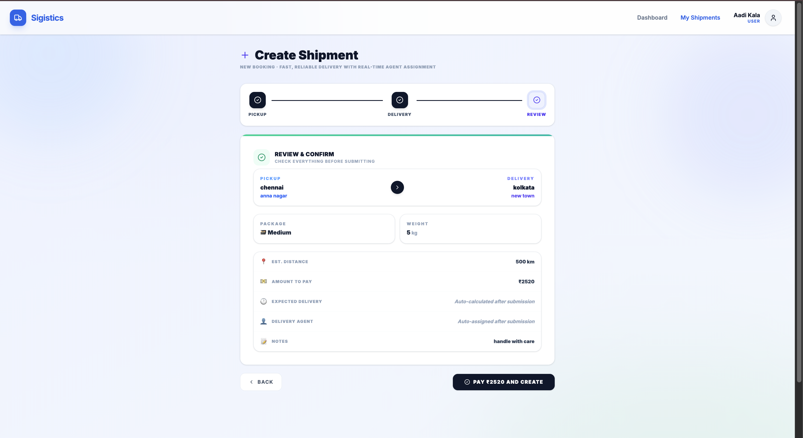
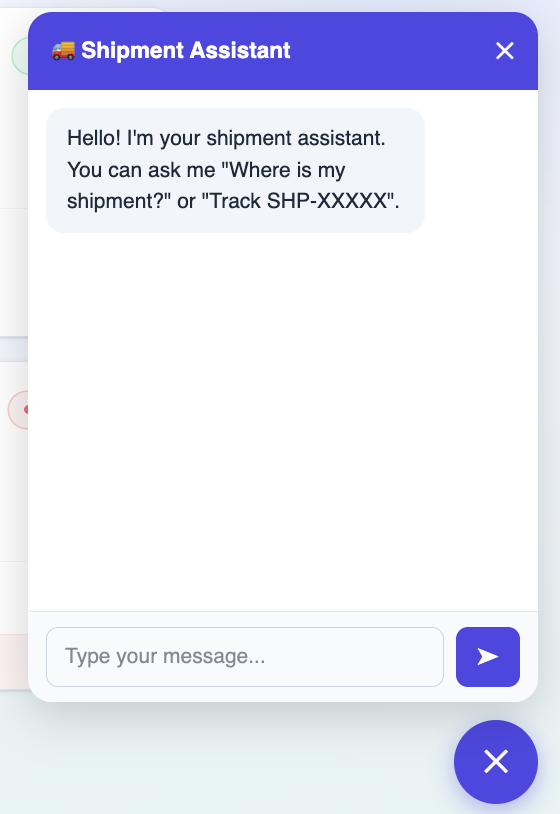
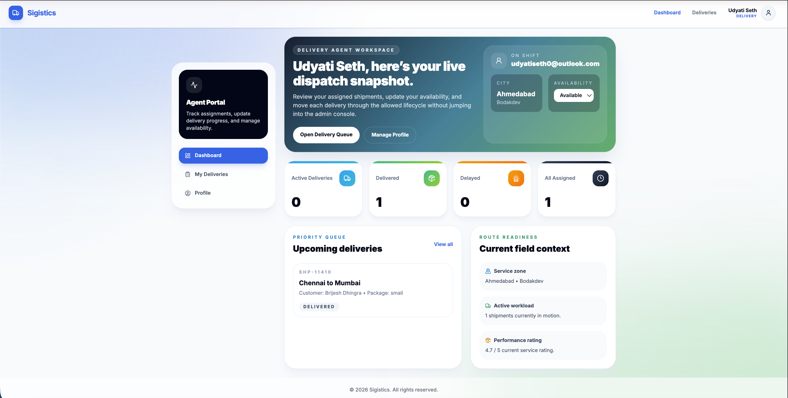

# Sigistics — Intelligent Logistics & Shipment Management Platform

A scalable, secure, and production-ready full-stack logistics platform that unifies shipment lifecycle management, AI-powered rule evaluation, real-time delivery agent tracking, fleet management, and integrated payment processing — designed for a three-tier actor model (Admin, Customer/Vendor, Delivery Agent).



---

## 🌟 Features

### User Authentication & Role Management
- 🔐 **Multi-Role Login** — Dedicated login flows for Admin (Staff), Customer (User), and Delivery Agent with role-aware routing
- 🔑 **Google OAuth 2.0** — One-click Google sign-in via Passport.js strategy
- 📧 **OTP Verification** — Email-based OTP verification for account activation via Nodemailer
- 🔄 **Forgot & Reset Password** — Secure tokenized password recovery flow
- 🛡️ **Role-Based Access Control (RBAC)** — Middleware-enforced separation across all Admin, User, and Agent routes
- 🔒 **JWT Authentication** — Stateless token-based authentication on all protected endpoints



---

### Admin — Dashboard
- 📈 **Aggregated KPIs** — Total shipments, active agents, revenue, and pending deliveries at a glance
- 📋 **Recent Shipment Feed** — Live snapshot of the latest shipment activity across the platform
- 👥 **Agent Fleet Summary** — Quick view of active vs inactive agents in the system
- 📊 **Analytics Charts** — Recharts-powered visual breakdowns of shipment volumes and status distribution



---

### Admin — Shipment Management
- 📦 **Full CRUD** — Create, read, update, and delete shipments across the entire fleet
- 📊 **Bulk Excel Import** — Import hundreds of shipments at once via Multer-parsed `.xlsx` upload
- 🏷️ **Tags & Delay Flags** — Automated shipment tagging applied by the Python Rule Engine after each evaluation
- 🔍 **Search, Filter & Sort** — Real-time search paired with multi-field filtering and column sorting
- 📄 **Server-Side Pagination** — Paginated responses ensure performance at scale



---

### Admin — Rule Engine Configuration
- ⚙️ **Rule Builder** — Create and manage business rules to evaluate shipments on conditions (distance, weight, status, ETA)
- 🔄 **Status Toggle** — Enable or disable individual rules with instant retroactive re-evaluation across all shipments
- ✅ **Bulk Re-evaluation** — Toggling or creating any rule triggers automatic re-evaluation of the entire shipments database
- 📋 **Rule Table** — Full CRUD interface with live rule status badges


---

### Admin — Agent Fleet Management
- 🚗 **Agent CRUD** — Add, update, deactivate, and manage the full delivery agent roster
- 🔍 **Search & Filter** — Find agents by name, status, or region with real-time filtering
- 📊 **Agent Status Badges** — Color-coded Active / Inactive indicators per agent record



---

### Admin — Location Management
- 📍 **Live Location Records** — View all agent location updates streamed from the field
- 🗺️ **Agent Coordinates** — Precise latitude and longitude records per agent per update cycle
- 📅 **Timestamped Entries** — Every location push is logged with a precise timestamp



---


### Customer — Shipment Dashboard
- 📦 **Personal Shipment View** — See all your active and past shipments with current status, tags, and delay indicators
- ➕ **Create Shipment** — Place new shipments through a guided, validated form
- 💳 **Razorpay Payment** — Seamlessly complete payment for each shipment before dispatch
- 📜 **Shipment History** — Full chronological record of all past shipments



---

### Customer — Create Shipment & Payment
- 📝 **Guided Form** — Step-by-step shipment creation with field validation enforced client and server side
- 💳 **Razorpay Checkout** — Secure in-app payment modal with order ID verification
- ✅ **HMAC Signature Verification** — Payment success is verified cryptographically on the backend before marking a shipment as paid



---

### AI-Powered Chatbot (Groq / Llama 3.1)
- 🤖 **Context-Aware Chat** — Shipment-aware conversational AI assistant powered by Groq's Llama 3.1 8B Instant model
- 💬 **Logistic Query Resolution** — Customers can inquire about shipment ETAs, statuses, and tracking information in natural language
- 🔒 **Authenticated Access** — Only logged-in users can access the chatbot interface



---

### Delivery Agent — Portal
- 📍 **Location Updates** — Push live location coordinates directly from the agent portal after each delivery milestone
- 🔄 **Status Updates** — Update delivery status (Picked Up → In Transit → Delivered) with a single action
- 🏠 **Agent Dashboard** — Quick overview of assigned shipments and current workload
- 👤 **Agent Profile** — View and manage personal credentials and profile information



---

### Python Rule Engine Microservice
- ⚡ **FastAPI / Uvicorn** — High-performance async Python microservice for rule computation
- 🎯 **Distance & ETA Calculation** — Business logic for computing delivery ETA and estimated route distance
- 🧩 **Beanie ODM & Motor** — Fully async MongoDB persistence for rule definitions and evaluation audit logs
- 📐 **Pydantic v2 Validation** — Schema-validated rule payloads for robust input processing

---

## 🛠️ Tech Stack

### Frontend
| Technology | Version | Purpose |
|------------|---------|---------|
| **React** | 19 | Component-based UI library |
| **Redux Toolkit** | Latest | Centralized global state management |
| **React Router DOM** | Latest | Client-side navigation with protected routes |
| **Axios** | ^1.15 | HTTP client — unified frontend API service layer |
| **Recharts** | Latest | Analytics charts for the Admin Dashboard |
| **Radix UI / Lucide React** | Latest | Accessible component primitives and icons |
| **Vite** | Latest | Build tool and development server |

### Backend (Node.js / Express)
| Technology | Version | Purpose |
|------------|---------|---------|
| **Node.js + Express** | v5 | REST API server and primary application gateway |
| **MySQL + Sequelize** | v6 | Relational database (Users, Agents, Shipments, Payments) |
| **MongoDB + Mongoose** | ^9.3 | Document store for logs and async records |
| **Passport.js + Google OAuth 2.0** | ^0.7 | Third-party authentication strategy |
| **JWT + bcryptjs** | Latest | Stateless token auth and password hashing |
| **Nodemailer** | ^8.0 | OTP and transactional email (Gmail SMTP) |
| **Multer + xlsx** | ^2.1 / ^0.18 | Multipart upload handling and Excel parsing |
| **Groq SDK** | ^1.1 | LLM inference client for the Llama 3.1 chatbot |
| **Razorpay** | ^2.9 | Payment gateway SDK |
| **Joi** | ^18.1 | Schema-based request validation |
| **express-rate-limit** | ^8.3 | API rate limiting middleware |

### Rule Engine (Python / FastAPI)
| Technology | Purpose |
|------------|---------|
| **FastAPI + Uvicorn** | ASGI framework for the async rule evaluation microservice |
| **Beanie ODM** | Async MongoDB object-document mapper |
| **Motor** | Async MongoDB driver underlying Beanie |
| **Pydantic v2** | Data validation and schema enforcement for rule payloads |

---

## 🚀 Setup Instructions

### Prerequisites
- Node.js 18+
- Python 3.10+
- MySQL 8+
- MongoDB 6+
- Razorpay account
- Groq API key
- Gmail account (for Nodemailer OTP)

### 1. Clone the Repository
```bash
git clone <repo-url>
cd "capstone project Till OM 2"
```

### 2. Set Up the Node.js Backend
```bash
cd node-backend
npm install
```

Create a `.env` file inside `/node-backend`:
```env
PORT=3000

# MySQL
MYSQL_HOST=localhost
MYSQL_USER=root
MYSQL_PASSWORD=your_mysql_password
MYSQL_DB=sigistics_db

# MongoDB
MONGO_URI=mongodb://localhost:27017/sigistics_logs

# JWT
JWT_SECRET=your_jwt_secret
JWT_EXPIRES_IN=7d

# Google OAuth
GOOGLE_CLIENT_ID=your_google_client_id
GOOGLE_CLIENT_SECRET=your_google_client_secret
GOOGLE_CALLBACK_URL=http://localhost:3000/auth/google/callback

# Nodemailer
EMAIL_USER=your_email@gmail.com
EMAIL_PASS=your_app_password

# Razorpay
RAZORPAY_KEY_ID=your_key_id
RAZORPAY_KEY_SECRET=your_key_secret

# Groq AI
GROQ_API_KEY=your_groq_api_key

# Rule Engine
RULE_ENGINE_URL=http://localhost:8000
```

Start the backend:
```bash
npm start
```

Seed the database (optional):
```bash
npm run seed
```

### 3. Set Up the Python Rule Engine
```bash
cd rule-engine
python -m venv venv
source venv/bin/activate      # On Windows: venv\Scripts\activate
pip install -r requirements.txt
```

Create a `.env` file inside `/rule-engine`:
```env
MONGO_URI=mongodb://localhost:27017/sigistics_rules
```

Start the rule engine:
```bash
uvicorn main:app --reload --port 8000
```

### 4. Set Up the React Frontend
```bash
cd frontend/react-app
npm install
npm run dev
```

### 5. Open your browser
```
http://localhost:5173
```

---

## 📁 Project Structure

```
capstone project Till OM 2/
│
├── node-backend/                          # Node.js / Express primary API
│   ├── app.js                             # Express app entry point
│   ├── seed_to_sql.js                     # Database seeder script
│   ├── generateData.js                    # Sample data generator
│   ├── sample_shipments.xlsx              # Sample shipment import file
│   ├── sample_agents.xlsx                 # Sample agent import file
│   ├── config/
│   │   ├── db.js                          # MongoDB connection
│   │   ├── sql.js                         # Sequelize / MySQL connection
│   │   └── passport.js                    # Google OAuth 2.0 strategy
│   ├── controllers/
│   │   ├── authController.js              # Login, signup, password reset
│   │   ├── authController.verifyOTP.js    # OTP verification logic
│   │   ├── googleAuthController.js        # Google OAuth callback handler
│   │   ├── userController.js              # User profile CRUD
│   │   ├── AdminShipmentController.js     # Admin shipment management
│   │   ├── UserShipmentController.js      # Customer shipment operations
│   │   ├── AdminAgentController.js        # Agent fleet management
│   │   ├── agentPortalController.js       # Agent portal operations
│   │   ├── AdminLocationController.js     # Location record management
│   │   ├── deliveryAgentController.js     # Delivery agent CRUD
│   │   ├── chatbotController.js           # Groq AI chatbot handler
│   │   └── paymentController.js           # Razorpay payment processing
│   ├── middleware/
│   │   ├── authenticate_middlewere.js     # JWT token verification
│   │   ├── roleVerifyMiddlewere.js        # RBAC role guard
│   │   └── ...                            # Rate limiter, validators, error handler
│   ├── models/
│   │   ├── user.sql.js                    # Sequelize User model
│   │   ├── agent.sql.js                   # Sequelize Agent model
│   │   ├── shipment.sql.js                # Sequelize Shipment model
│   │   ├── shipment_history.sql.js        # Shipment history log model
│   │   ├── location.sql.js                # Location record model
│   │   ├── Payment.js                     # Payment model
│   │   └── index.sql.js                   # Sequelize associations
│   ├── routes/
│   │   ├── authRoute.js                   # Auth endpoints
│   │   ├── ShipmentRoutes.js              # Admin shipment routes
│   │   ├── userShipmentRoutes.js          # Customer shipment routes
│   │   ├── AgentRoutes.js                 # Agent management routes
│   │   ├── agentPortalRoutes.js           # Agent portal routes
│   │   ├── locationRoutes.js              # Location update routes
│   │   ├── adminDashboardRoutes.js        # Dashboard stat routes
│   │   ├── chatbotRoutes.js               # Chatbot routes
│   │   ├── paymentRoutes.js               # Payment routes
│   │   └── UserRoute.js                   # User profile routes
│   ├── services/                          # Business logic layer
│   ├── utils/                             # Helper utilities
│   └── utilsPayment/                      # Payment utility helpers
│
├── rule-engine/                           # Python / FastAPI microservice
│   ├── main.py                            # FastAPI app entry point
│   ├── requirements.txt                   # Python dependencies
│   ├── seed-rules.py                      # Rule seeding script
│   ├── config/                            # MongoDB connection config
│   ├── models/                            # Beanie document models
│   └── services/                          # Rule evaluation logic
│
└── frontend/react-app/                    # React / Vite frontend
    ├── index.html
    ├── vite.config.js
    └── src/
        ├── App.jsx                        # Root component with all routes
        ├── main.jsx                       # React app entry point
        ├── pages/
        │   ├── AdminDashboard.jsx         # Admin KPI dashboard
        │   ├── ShipmentManagement.jsx     # Admin shipment management
        │   ├── AgentManagement.jsx        # Admin agent fleet management
        │   ├── LocationManagement.jsx     # Admin location monitor
        │   ├── RuleManagement.jsx         # Rule engine configuration UI
        │   ├── AllUsers.jsx               # Admin user management
        │   ├── LandingPage.jsx            # Customer landing page
        │   ├── auth/                      # Login / Signup / OTP pages
        │   ├── user/                      # Customer shipment & profile pages
        │   ├── agent/                     # Agent portal pages
        │   └── delivery/                  # Delivery-specific pages
        ├── components/                    # Reusable UI components
        ├── hooks/                         # Custom React hooks
        ├── store/                         # Redux store & slices
        ├── routes/                        # Protected route configuration
        ├── services/                      # Axios API call services
        └── utils/                         # Frontend utility helpers
```

---

## 🔧 API Endpoints

### Auth
- `POST /auth/signup` — Register a new customer account
- `POST /auth/login` — Login as a customer
- `POST /auth/login/staff` — Login as an admin
- `POST /auth/login/agent` — Login as a delivery agent
- `POST /auth/verify-otp` — Verify email OTP
- `POST /auth/forgot-password` — Trigger password reset email
- `POST /auth/reset-password/:token` — Reset password via token
- `GET /auth/google` — Initiate Google OAuth login
- `GET /auth/google/callback` — Google OAuth callback

### Shipments (Admin)
- `GET /api/shipments` — Get all shipments with filters, search, and pagination
- `POST /api/shipments` — Create a new shipment
- `PUT /api/shipments/:id` — Update a shipment
- `DELETE /api/shipments/:id` — Delete a shipment
- `POST /api/shipments/bulk-upload` — Bulk import shipments from `.xlsx`
- `POST /api/shipments/evaluate-rules` — Trigger retroactive rule evaluation

### Shipments (Customer)
- `GET /api/user/shipments` — Get all shipments for the logged-in customer
- `POST /api/user/shipments` — Create a new shipment

### Agent Management (Admin)
- `GET /api/agents` — Get all delivery agents
- `POST /api/agents` — Create a new delivery agent
- `PUT /api/agents/:id` — Update agent details
- `DELETE /api/agents/:id` — Deactivate an agent

### Agent Portal
- `GET /api/agent-portal/shipments` — Get assigned shipments for the logged-in agent
- `PATCH /api/agent-portal/shipments/:id/status` — Update shipment delivery status

### Locations
- `GET /api/locations` — Get all location records (Admin)
- `POST /api/locations` — Push a new location update (Agent)

### Dashboard (Admin)
- `GET /api/dashboard/stats` — Aggregated platform statistics
- `GET /api/dashboard/recent-shipments` — Recent shipment activity feed

### Payments
- `POST /api/payment/create-order` — Create a Razorpay payment order
- `POST /api/payment/verify` — Verify Razorpay payment signature

### Chatbot
- `POST /api/chatbot` — Send a message and receive an AI-generated response (Groq / Llama 3.1)

### Rule Engine (Python FastAPI — Port 8000)
- `GET /rules` — Fetch all configured rules
- `POST /rules` — Create a new rule
- `PUT /rules/{id}` — Update an existing rule
- `DELETE /rules/{id}` — Delete a rule
- `PATCH /rules/{id}/toggle` — Enable or disable a rule
- `POST /rules/evaluate` — Evaluate all shipments against active rules

---

## 🎨 Features in Detail

### Python Rule Engine Microservice
The rule engine is a fully decoupled Python/FastAPI microservice communicating with the Node.js backend over REST:
- **Non-blocking I/O** — Beanie ODM and Motor async driver ensure every MongoDB operation is completely non-blocking
- **Retroactive Evaluation** — Every time a rule is toggled or created from the Admin panel, the frontend calls `POST /rules/evaluate` to re-apply updated rule logic to all existing shipments
- **Pydantic v2 Validation** — All incoming rule payloads are strictly validated before any evaluation logic runs

### Bulk Shipment Import (Multer + xlsx)
- **Multer** parses the multipart `.xlsx` file upload from the Admin panel
- **xlsx** processes the file row-by-row into a structured JSON payload
- Each row is validated before mass insertion into MySQL via Sequelize
- Sample import files (`sample_shipments.xlsx`, `sample_agents.xlsx`) are included in the repository

### Razorpay Payment Flow
1. **Order Creation** — Backend calls Razorpay API to create a payment order; returns `order_id` to the frontend
2. **Client Payment** — Frontend renders the Razorpay checkout modal using the `order_id`
3. **Signature Verification** — On success, the backend performs HMAC signature verification before marking the shipment as paid

### AI Chatbot (Groq / Llama 3.1)
- Backend injects live shipment context from the database into the system prompt before each API call
- Model: `llama-3.1-8b-instant` via Groq Cloud for ultra-low inference latency
- All chatbot requests require authentication — only logged-in users can access the interface

### Role-Based Access Control
- **Frontend Route Guards** — Separate protected route configs for Admin, Customer, and Agent prevent unauthorized rendering
- **JWT Middleware (`authenticate_middlewere.js`)** — Verifies the JWT on every protected request; expired tokens rejected with 401
- **Role Middleware (`roleVerifyMiddlewere.js`)** — Checks the decoded role against route requirements; wrong role returns 403

---

## 👥 Team

| Member | Responsibilities |
|--------|-----------------|
| **[Team Member 1]** | Project architecture, Node.js backend, authentication system, RBAC middleware |
| **[Team Member 2]** | Admin dashboard, shipment management, bulk Excel import pipeline |
| **[Team Member 3]** | Python Rule Engine microservice, Beanie/Motor async persistence |
| **[Team Member 4]** | Customer shipment portal, Razorpay payment integration |
| **[Team Member 5]** | Delivery Agent portal, location update system |
| **[Team Member 6]** | Groq AI chatbot integration, rule engine frontend UI |
| **[Team Member 7]** | Agent fleet management, Admin location management module |

---

## 🔮 Future Enhancements

- [ ] Real-time delivery tracking map with live location updates from agents
- [ ] SMS and push notification alerts for every shipment status transition
- [ ] Advanced analytics with trend graphs, heatmaps, and route optimization insights
- [ ] Microservices containerization via Docker and Kubernetes
- [ ] Mobile application for delivery agents built with React Native
- [ ] Multi-currency and international address support
- [ ] Automated ETA recalculation with traffic-aware routing data

## 🐛 Known Issues

- None at this time

---

**Built with ❤️ by the Sigistics Team — Capstone Project 2026**
