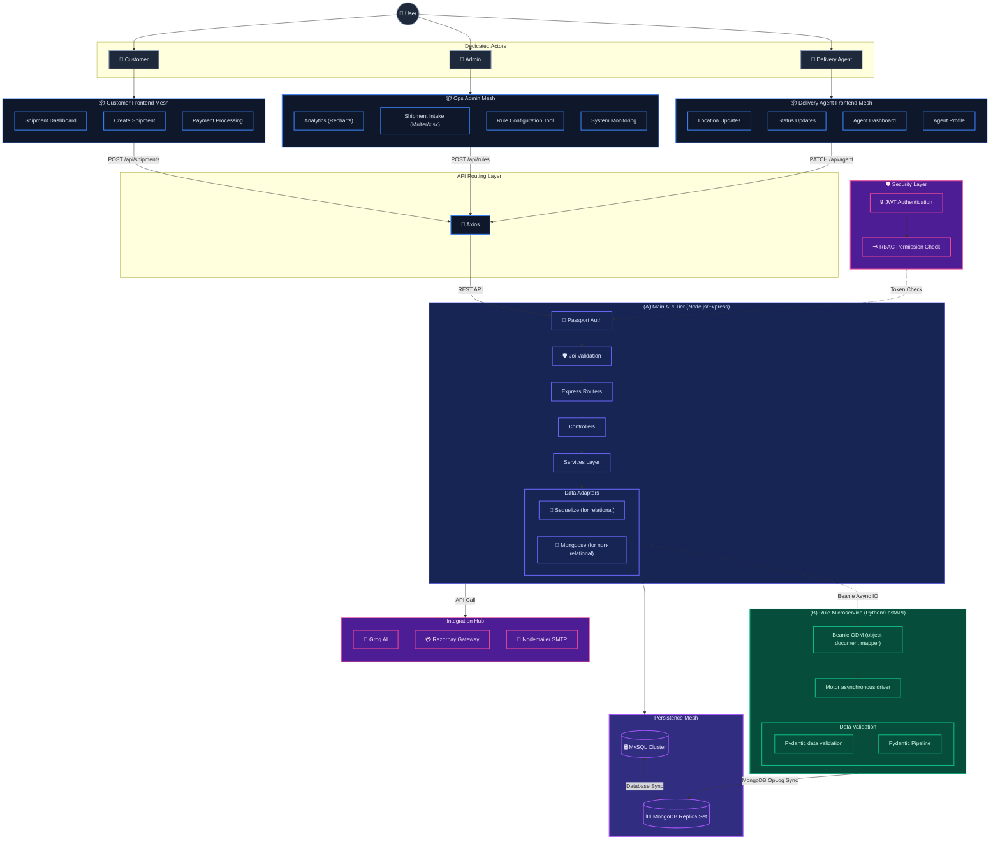

# Sigistics: Final Full-Stack MVC Architecture Blueprint

This document presents the definitive architectural blueprint for the Sigistics platform. It captures the dedicated multi-role frontend meshes, the unified Axios communication layer, and the highly detailed MVC backend structure (Node.js & Python), refined for absolute textual accuracy and structural clarity.

## System Architecture Blueprint

## Architectural Additions Tracked
1. **Ultimate Hierarchy**: Singular `User` splitting strictly into `Customer`, `Admin`, and `Delivery Agent`.
2. **True Frontend Representation**: `Delivery Portal` explicitly replaces hallucinations like Google Maps.
3. **Deep MVC Core**: `Express Routers` pass precisely into `Controllers` and down to `Services Layer` prior to triggering database ORMs.
4. **Security Integrity**: Eliminated visual duplications; Security Layer operates with a single `JWT` handshake and a singular `RBAC` role check.
i s
